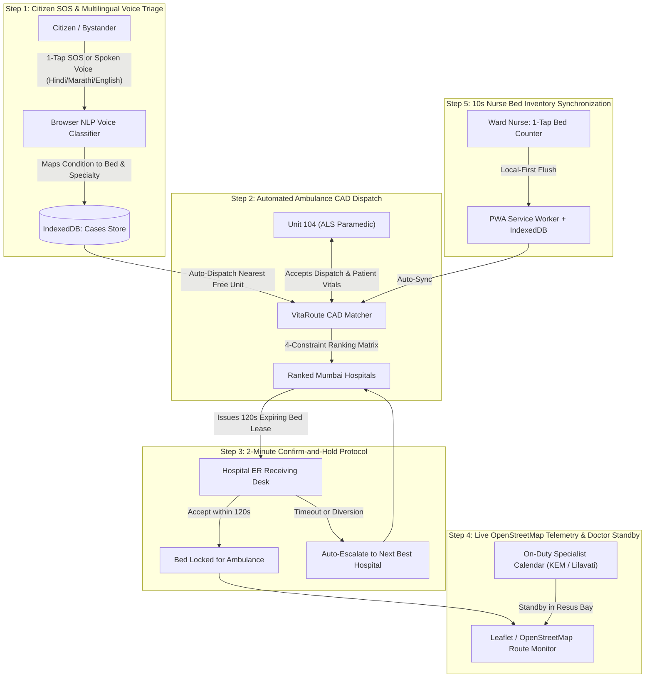

# VitaRoute (T47-VitaRoute)
### Mission-Critical Real-Time Hospital Bed Allocation, Automated Emergency CAD & Multilingual Citizen Voice Triage (Mumbai Metropolitan Region)

[](https://vitaroute-app.vercel.app)
[](https://vitaroute-app.vercel.app)
[](https://hl7.org/fhir/)
[](https://developer.mozilla.org/en-US/docs/Web/API/IndexedDB_API)
[](https://vitaroute-app.vercel.app)
[](LICENSE)

---

## 1. Overview & Problem Statement

In life-threatening medical emergencies (STEMI acute myocardial infarction, multi-trauma road accidents, hypoxic respiratory distress, acute ischemic stroke, and major third-degree burns), minutes dictate survival. 

In high-density metropolitan hubs like **Mumbai**, emergency response faces systemic fragmentation:
- **Blind Transports**: Paramedics drive to an Emergency Room only to discover that ICU ventilators are full, the Cath Lab is unavailable, or the trauma surgeon is in surgery.
- **Nurse Form Friction**: Busy ward nurses are forced into complex desktop EHR/HIS workflows that take 5+ minutes, causing bed inventory data to become stale and unreliable.
- **Reservation Collisions**: Multiple ambulances compete for the same open ICU bed without atomic lock reservation protocols.
- **Language Barriers in Triage**: Panicked citizens and bystanders struggle with complex forms during high-stress crises.

**VitaRoute** solves this with a lightweight, decentralized, and humanized coordination platform engineered for the **Mumbai Metropolitan Region**. It connects citizens, ambulance paramedics, ward nurses, and ER physicians through a real-time, 4-constraint matching engine, 120-second atomic bed leases, live OpenStreetMap telemetry, multilingual voice recognition (Hindi, Marathi, English), and persistent client-side IndexedDB storage.

---

## 2. Real-World Mumbai Emergency Hospital Network

VitaRoute is configured with real geographic coordinates, trauma designations, and surgical specialties across major Mumbai hospitals:

| Hospital Name | Location | Designation | Direct Radio | GPS Coordinates |
| :--- | :--- | :--- | :--- | :--- |
| **King Edward Memorial Hospital (KEM)** | Parel Medical Hub | Level 1 Apex Polytrauma & Municipal Center | MUM-EMS CH-1 (155.340 MHz) | `18.9986° N, 72.8427° E` |
| **Lilavati Hospital & Research Centre** | Bandra West Reclamation | Level 1 Cardiac, Stroke & Critical Care Hub | MUM-EMS CH-2 (155.280 MHz) | `19.0514° N, 72.8295° E` |
| **P. D. Hinduja National Hospital** | Mahim West | Level 1 Polytrauma & Interventional Neuro | MUM-EMS CH-3 (155.385 MHz) | `19.0330° N, 72.8397° E` |
| **Kokilaben Dhirubhai Ambani Hospital** | Andheri West | Comprehensive Stroke & Multi-Organ Center | MUM-EMS CH-4 (155.220 MHz) | `19.1314° N, 72.8252° E` |
| **LTMGH (Sion Hospital)** | Eastern Expressway, Sion | Regional Apex Polytrauma & Severe Burn Center | MUM-EMS CH-5 (155.400 MHz) | `19.0390° N, 72.8600° E` |
| **Bombay Hospital & Medical Research Centre** | Marine Lines, South Mumbai | Level 1 Interventional Cardiology & Neurosurgery | MUM-EMS CH-6 (155.150 MHz) | `18.9388° N, 72.8286° E` |
| **Nanavati Max Super Speciality Hospital** | SV Road, Vile Parle West | Level 1 Polytrauma & Acute Burn Center | MUM-EMS CH-7 (155.420 MHz) | `19.0968° N, 72.8402° E` |

---

## 3. End-to-End System Architecture



---

## 4. Key Innovations & Technical Implementation

### 1. Persistent IndexedDB Storage Engine (`vitaroute_mumbai_db`)
- Zero data loss on refresh: Emergency cases, active holds, citizen SOS requests, hospital bed inventory, and doctor rosters are persisted client-side in native browser `IndexedDB` with fallback to `localStorage`.
- Dedicated object stores: `emergencies`, `holds`, `citizen_sos`, `hospitals`, `doctors`.
- Every added emergency case genuinely persists, links to CAD dispatch, and generates hospital ER reservations.

### 2. Automated CAD Matching Engine
- Multi-constraint scoring algorithm ranks regional hospitals based on:
  1. **Matching Open Beds**: ICU Ventilator, ICU Non-Ventilator, Oxygen Bed, Cardiac Monitored, Burns Isolation, Trauma Resuscitation.
  2. **Clinical Specialties Available**: Cath Lab (PCI), ECMO Standby, Stroke Thrombectomy, Burn Unit, Level 1 Trauma.
  3. **Live Road Travel Time (ETA)**: Calculated using OSRM road routing engine and Haversine distance adjusted for Mumbai urban road tortuosity.
  4. **Data Freshness**: Weight penalty applied for stale bed reports (>15m Amber, >45m Red).
  5. **ER Load / Surge Status**: Low, Medium, Surge, and Diversion status penalties.

### 3. 2-Minute (120s) Confirm-and-Hold Lease
- When an ambulance requests a bed, the destination hospital's ER desk is notified with an urgent audio tone.
- A high-contrast circular countdown ring (`CountdownRing.tsx`) shows exact seconds remaining.
- If accepted, the bed is locked and assigned to a specific resuscitation bay.
- If rejected or if the 120-second timer expires without acknowledgement, VitaRoute automatically cascades the hold to the next-best regional hospital.

### 4. 10-Second Bed Updates for Ward Nurses
- Replaces 5-minute desktop EHR data-entry forms with tactile `+` and `-` touch buttons.
- Minimum 48px tactile touch targets designed for mobile use on ward floors.
- Works offline in shielded ICU units and basement corridors via PWA background sync.

### 5. Multilingual Citizen Voice Triage (English, Hindi, Marathi)
- Integrated Web Speech API (`SpeechRecognition` / `webkitSpeechRecognition`) supporting:
  - English (`en-IN`)
  - Hindi (`hi-IN`)
  - Marathi (`mr-IN`)
- Natural Language Clinical Classifier parses keywords across all 3 languages (e.g., *छाती में दर्द*, *हृदयविकार*, *श्वास घेण्यास त्रास*, *हादसा*, *अपघात*, *पक्षाघात*, *भाजले*).
- Auto-classifies emergency category, maps required bed type and surgical specialty, and auto-dispatches an ambulance.

### 6. OmniDimension Conversational Voice AI
- Integrated OmniDimension Voice AI web widget (`omnidim.io`) allowing hands-free spoken queries, emergency guidance, and citizen assistance.

### 7. Live OpenStreetMap & Leaflet Telemetry
- Real-time road map (`LeafletEmergencyMap.tsx`) tracks the moving ALS ambulance along Mumbai road vectors.
- Displays patient pickup scene, ambulance position, destination hospital receiving bay, speed telemetry, and dynamic ETA.

### 8. Doctor Availability & On-Call Shift Calendar
- Real-time doctor duty toggle (`DoctorRosterView.tsx`) per hospital:
  - Available (Ready for incoming ER cases)
  - In Surgery (OR active with estimated duration)
  - On-Call (15-minute rapid standby)
  - Off-Duty
- Weekly shift schedule calendar showing coverage across critical trauma and surgical departments.

---

## 5. Clean Hospital-Grade UI & Sign-In Experience

- **Aesthetic**: Minimalist, humanized, hospital-standard red and white clinical styling.
- **Zero Emoji Clutter**: Professional medical typography, clear badges, and high-visibility status indicators.
- **Dedicated Sign-In Modal**: Moved heavy login forms off the landing page into a focused, frosted-glass Sign In modal with 1-tap demo access for each role.
- **Heartbeat ECG Lifeline**: Animated hero background featuring an SVG cardiogram pulse with frosted glassmorphism cards for readability.

---

## 6. Authorized Demo Accounts (1-Tap Login)

The platform provides pre-configured role accounts for hackathon demonstration:

| Role | Name & Station | Demo Email | Password | Primary Workflow |
| :--- | :--- | :--- | :--- | :--- |
| **Ambulance CAD** | Paramedic Arjun Singh (Unit 104, Bandra) | `ambulance@demo.com` | `demo123` | View automated match, dispatch CAD, requested bed |
| **Ward Nurse** | Sister Anjali Deshmukh (KEM Ward 3) | `nurse@demo.com` | `demo123` | 10-second increment/decrement bed counter |
| **ER Physician** | Dr. Rohan Merchant (KEM ER Desk) | `hospital@demo.com` | `demo123` | 120-second incoming ambulance bed hold confirmation |
| **Citizen SOS** | Rajesh Kumar (Mumbai Citizen) | `patient@demo.com` | `demo123` | 1-Tap SOS, Multilingual Voice triage, Live tracker |
| **On-Call Doctor** | Dr. Sneha Kulkarni (Trauma Specialist) | `doctor@demo.com` | `demo123` | Doctor shift calendar & duty status toggle |
| **Regional Admin** | Mumbai Emergency Operations Center | `admin@demo.com` | `demo123` | Regional diversion, surge simulation, and fleet stats |

---

## 7. Technology Stack

- **Framework**: React 19, TypeScript
- **Styling**: Tailwind CSS v4, Lucide Icons
- **Mapping & Telematics**: Leaflet, OpenStreetMap, OSRM Road Routing API
- **Persistence**: IndexedDB (Native Web API), LocalStorage fallback, PWA Cache API
- **Speech & Audio**: Web Speech API (`webkitSpeechRecognition`), Web Audio API Sound Synthesizer
- **Voice AI Agent**: OmniDimension Web Widget
- **Build Tool**: Vite 8.3
- **Hosting**: Vercel Production (`https://vitaroute-app.vercel.app`)

---

## 8. Getting Started Locally

### Prerequisites
- Node.js (v18 or higher)
- npm or pnpm

### Installation
```bash
# Clone the repository
git clone https://github.com/bahuli1203/T47-VitaRoute.git

# Navigate into project directory
cd T47-VitaRoute

# Install dependencies
npm install

# Start local development server
npm run dev
```

### Production Build
```bash
# Verify TypeScript types
npx tsc --noEmit

# Compile production bundle
npm run build

# Preview production build locally
npm run preview
```

---

## 9. Live Deployment

VitaRoute is deployed on Vercel with automatic CI/CD:
- **Production URL**: [https://vitaroute-app.vercel.app](https://vitaroute-app.vercel.app)
- **Repository**: [https://github.com/bahuli1203/T47-VitaRoute](https://github.com/bahuli1203/T47-VitaRoute)

---

## 10. License

This project is licensed under the MIT License - see the [LICENSE](LICENSE) file for details.
