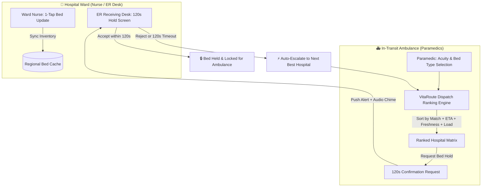

# VitaRoute (T47-VitaRoute)
### Mission-Critical Real-Time Hospital Bed Allocation & Intelligent Emergency Medical Dispatch

[](https://github.com/bahuli1203/T47-VitaRoute)
[](https://hl7.org/fhir/)
[](LICENSE)

---

## 📌 Executive Summary & Problem Statement

In critical medical emergencies (STEMI cardiac arrest, acute respiratory distress, severe burns, multi-trauma), minutes dictate survival. An ambulance crew with a deteriorating patient cannot afford phone-tag or arriving at a hospital only to find its ICU beds occupied or specialists unavailable.

**VitaRoute** solves this with a lightweight, decentralized, and fail-safe coordination architecture composed of three synchronized pillars:

1. **⚡ 10-Second Bed-Update Screen for Ward Nurses**
   - High-contrast, one-tap increment/decrement interface designed for budget mobile phones and tablets.
   - Zero-overhead data entry; updates take less than 10 seconds per shift/event.
   - Clear visual status and timestamp tracking showing exact data freshness down to the minute.
2. **🧭 Multi-Factor Intelligent Dispatch Matrix**
   - Real-time CAD (Computer-Aided Dispatch) ranking engine tailored for ambulance paramedics.
   - Dynamic algorithmic scoring balancing **Bed Match Acuity**, **Estimated Travel Time & Distance**, **Data Freshness (minutes old)**, and **Current Hospital/ER Strain**.
   - Immediate clinical preset matching (ICU Ventilator, High-Flow O2, Burns Isolation, Trauma Resuscitation, Cardiac Monitored).
3. **⏱️ 2-Minute Confirm-and-Hold Protocol with Cascading Escalation**
   - When dispatch requests a bed, the target hospital ER receiving desk receives an urgent 120-second reservation request.
   - ER staff accept (locking the bed exclusively for that ambulance) or reject (specifying diversion reason).
   - If rejected or if the 120-second timer expires without confirmation, VitaRoute **automatically cascades to the next-best regional hospital**, preventing deadlocks and ambulance idling.

---

## 🏗️ System Architecture & Workflow Flowchart



---

## 🔍 Missing Bottlenecks Identified & VitaRoute Solutions

| Identified Real-World Bottleneck | Root Cause | VitaRoute Mitigation Strategy |
| :--- | :--- | :--- |
| **Nurse Data-Entry Friction** | Complex EHR/EMR desktop interfaces take 5+ minutes to log bed status. | **10-Second Touch Mode**: Ultra-simplified mobile UI with giant touch targets, haptic feedback, and instant sync. |
| **Stale Bed Telemetry** | Hospitals update status irregularly; dispatch acts on obsolete information. | **Explicit Freshness Badging**: Every hospital card displays exact data age in minutes with tiered color indicators (<15 min Fresh, 15–45 min Amber, >45 min Stale Penalty). |
| **Simultaneous Reservation Race Conditions** | Two ambulances requesting the last ICU bed simultaneously. | **Atomic Distributed Leases**: Temporary 120-second reservation locks decrement available inventory instantly upon request. |
| **ER Inattention / Cognitive Overload** | ER staff busy with critical cases fail to see incoming web requests. | **Urgent Audio-Visual Alarm + 120s Auto-Escalation**: System never waits indefinitely; switches to secondary hospital automatically upon timeout. |
| **Network Dead Zones in Hospital Basements** | Shielded ICU wards lose cellular/Wi-Fi signal. | **PWA Offline Queue (Service Worker + IndexedDB)**: Optimistic UI updates with background synchronization when connectivity resumes. |

---

## 📱 Mobile Application & Progressive Web App (PWA) Implementation Strategy

VitaRoute is architected to operate seamlessly across low-cost mobile devices, rugged ambulance tablets, and emergency control rooms:

### 1. Progressive Web App (PWA) Layer
- **Zero-Install Deployment**: Instant access via URL with "Add to Home Screen" prompt for both municipal EMS and private hospital networks.
- **Service Worker Caching**: Shell and assets cached via CacheStorage for offline boot.
- **Background Sync**: Background Sync API handles bed status updates submitted during intermittent drops.
- **Web Push Notifications**: Push API + Web Audio API trigger high-priority alerts even when the browser tab is minimized.

### 2. Native Wrapper Roadmap (Capacitor / React Native)
- Background Geolocation with high-frequency GPS tracking for ambulance telemetry.
- Hardware wake-lock API preventing device sleep during active patient transport.
- BLE (Bluetooth Low Energy) beacon integration for automatic ambulance bay arrival detection.

---

## 🛠️ Technology Stack

- **Frontend Core**: React 19, TypeScript
- **Styling & Design System**: Tailwind CSS v4, Lucide Icons
- **Animation & Visual Feedback**: Motion, Canvas SVG Countdown
- **Audio Telemetry Engine**: Web Audio API Sound Synthesizer (Zero-latency tones & haptic vibration)
- **State & Sync**: React Context API with LocalStorage caching and optimistic updates
- **Standards Alignment**: NEMSIS (National EMS Information System) & HL7 FHIR (Fast Healthcare Interoperability Resources)

---

## 🚀 Getting Started

### Prerequisites
- Node.js (version 18 or higher recommended)
- npm or yarn

### Installation & Run

1. Clone the repository:
   ```bash
   git clone https://github.com/bahuli1203/T47-VitaRoute.git
   cd T47-VitaRoute
   ```

2. Install dependencies:
   ```bash
   npm install
   ```

3. Run the development server:
   ```bash
   npm run dev
   ```

4. Build for production:
   ```bash
   npm run build
   ```

---

## 📄 License
This project is licensed under the MIT License - see the [LICENSE](LICENSE) file for details.
