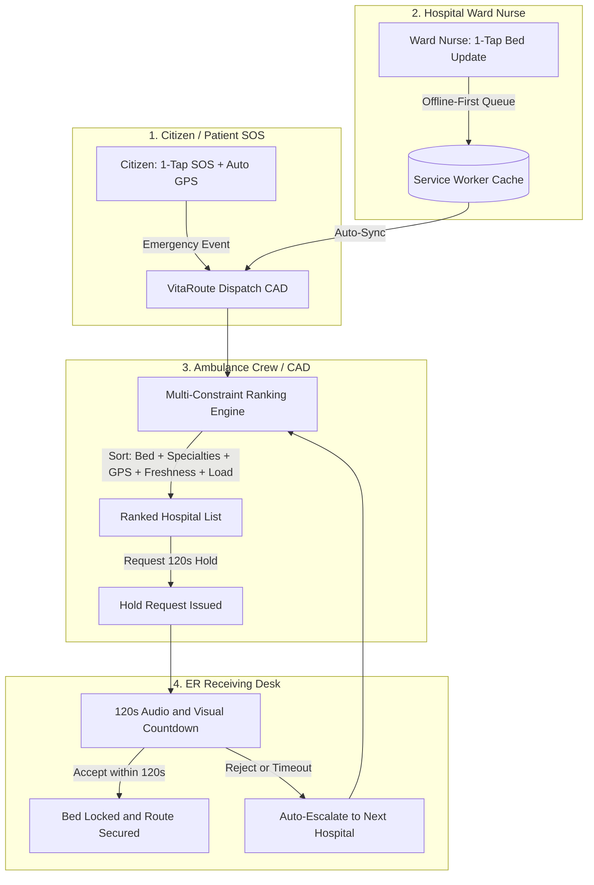

# VitaRoute (T47-VitaRoute)
### Mission-Critical Real-Time Hospital Bed Allocation and Intelligent Emergency Medical Dispatch

[](https://github.com/bahuli1203/T47-VitaRoute)
[](https://hl7.org/fhir/)
[](LICENSE)

---

## Executive Summary and Problem Statement

In critical medical emergencies (STEMI cardiac arrest, acute respiratory distress, severe burns, multi-trauma), minutes dictate survival. An ambulance crew with a deteriorating patient cannot afford phone-tag or arriving at a hospital only to find its ICU beds occupied or specialists unavailable.

VitaRoute solves this with a lightweight, decentralized, and fail-safe coordination architecture composed of four synchronized modules:

1. **1-Tap Citizen Emergency SOS Screen**
   - Direct emergency dispatch trigger for patients and bystanders with automatic browser GPS location acquisition.
   - Immediate clinical categorization (Cardiac, Respiratory Distress, Major Trauma, Severe Burns, Stroke, General Emergency).
   - Real-time CAD status tracking displaying assigned ALS ambulance call sign and arrival ETA.

2. **10-Second Bed-Update Screen for Ward Nurses**
   - High-contrast, one-tap increment and decrement interface with minimum 48px tactile touch targets designed for budget mobile phones.
   - PWA Service Worker caching and background sync queue allowing reliable offline bed updates inside shielded ICU basements and dead zones.
   - Clear visual status and timestamp tracking showing exact data freshness down to the minute.

3. **Multi-Constraint Intelligent Dispatch Matrix**
   - Real-time CAD (Computer-Aided Dispatch) ranking engine tailored for ambulance paramedics.
   - Dynamic algorithmic scoring balancing:
     - Primary Bed Match (ICU Ventilator, High-Flow O2, Burns Isolation, Trauma Resuscitation, Cardiac Monitored)
     - Secondary Surgical and Clinical Specialties (Cath Lab / Primary PCI, ECMO, Thrombectomy, Burn ICU, PICU, Level 1 Trauma)
     - Live Haversine Road Distance and Emergency Travel Time (derived from live GPS or sector origin)
     - Data Freshness in minutes (<15 min Fresh, 15-45 min Amber, >45 min Stale)
     - Hospital and ER Strain (Low, Medium, Surge, Diversion)

4. **2-Minute Confirm-and-Hold Protocol with Cascading Escalation**
   - When dispatch requests a bed, the target hospital ER receiving desk receives an urgent 120-second reservation request.
   - ER staff accept (locking the bed exclusively for that ambulance) or reject (specifying diversion reason).
   - If rejected or if the 120-second timer expires without confirmation, VitaRoute automatically cascades to the next-best regional hospital, preventing deadlocks and ambulance idling.

---

## System Architecture Flowchart



---

## Bottleneck Mitigations Implemented in VitaRoute

| Real-World Bottleneck | Root Cause | VitaRoute Mitigation Strategy |
| :--- | :--- | :--- |
| **Nurse Data-Entry Friction** | Complex desktop EHR/EMR forms require multiple dropdowns and 5+ minutes. | **10-Second Tactile Mode**: Oversized 48px touch targets, zero form clutter, 1-tap increment/decrement with haptic feedback. |
| **Hospital Basement Dead Zones** | Lead-shielded ICU units and radiology basements lose cellular and Wi-Fi signal. | **PWA Offline Queue (Service Worker + LocalStorage)**: Bed updates save locally and flush to the regional broker automatically upon signal recovery. |
| **Simultaneous Reservation Conflicts** | Multiple ambulances requesting the last ICU bed simultaneously. | **120-Second Atomic Expiring Leases**: Inventory decrements optimistically upon request and auto-releases on timeout or cancellation. |
| **Multi-Specialty Clinical Mismatch** | Hospital has an ICU bed but lack on-duty specialist (e.g. burn surgeon or cath lab team). | **Multi-Constraint Matching**: Algorithms evaluate both the bed category and all simultaneous required specialties. |
| **Static Distance Distortions** | Static sector estimates fail to reflect real ambulance position. | **Live Haversine GPS Modeling**: Real-time browser geolocation calculations with dynamic speed multipliers for emergency response. |
| **ER Inattention and Alarm Fatigue** | Busy triage doctors do not watch web dashboards continuously. | **Multi-Tier Audio Alarms and Auto-Escalation**: Synthesized urgency audio alerts; automatic failover to the next best facility if unacknowledged at 120 seconds. |

---

## Mobile Application and PWA Implementation Details

- **PWA Manifest (`manifest.json`)**: Configured for standalone full-screen operation on Android, iOS, and mobile Chrome with custom shortcuts for Citizen SOS, Nurse Update, and Ambulance CAD.
- **Service Worker (`public/sw.js`)**: Implements stale-while-revalidate caching, background sync event listeners (`sync-beds`), and high-priority push notifications.
- **Zero-Install Deployment**: Available instantly via link on any budget smartphone without requiring App Store approvals.

---

## Technology Stack

- **Frontend Core**: React 19, TypeScript
- **Styling**: Tailwind CSS v4, Lucide Icons
- **Geolocation**: HTML5 Geolocation API, Haversine formula calculation
- **Audio Telemetry**: Web Audio API Sound Synthesizer (zero-latency tones and alerts)
- **Offline Storage**: Service Worker Cache API and LocalStorage sync queue
- **CAD Standards**: NEMSIS (National EMS Information System) and HL7 FHIR aligned

---

## Getting Started

### Prerequisites
- Node.js (version 18 or higher)
- npm or yarn

### Installation and Development

1. Clone the repository:
   ```bash
   git clone https://github.com/bahuli1203/T47-VitaRoute.git
   cd T47-VitaRoute
   ```

2. Install dependencies:
   ```bash
   npm install
   ```

3. Run the development server:
   ```bash
   npm run dev
   ```

4. Build for production:
   ```bash
   npm run build
   ```

---

## License
This project is licensed under the MIT License - see the [LICENSE](LICENSE) file for details.
